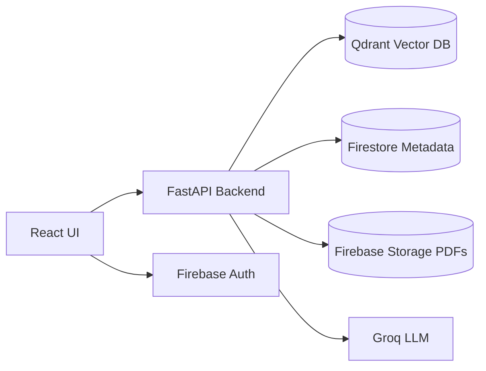

# UniQuery AI — Full Product Requirements Document (PRD v2)

> **Version:** 2.0
> **Mode:** Hybrid (Academic + Engineering)
> **Interface:** Guided Query + Conversational Clarification
> **Deployment:** Cloud, Free Tier
> **LLM:** Groq (Mixtral 8x7B / Llama3)
> **Vector DB:** Qdrant Cloud
> **Storage:** Firebase Storage
> **Auth:** Firebase Auth
> **Metadata:** Firestore
> **Embeddings:** `bge-small-en` (free)
> **UI Style:** Dashboard + Guided Filters + Chat + Analytics

---

## 1. Executive Summary

Universities store academic information across scattered PDFs, syllabi, circulars, notices, exam rules, attendance policies, academic calendars, and department-specific documents. Students repeatedly ask the same questions to faculty and administrative staff, causing inefficiency, delays, and misinformation.

**UniQuery AI** solves this by creating a centralized, AI-powered academic assistant that:

- Accepts natural language questions
- Uses guided context filters (Program → Department → Semester)
- Retrieves relevant chunks from official docs using RAG
- Synthesizes grounded answers with citations
- Provides analytics to admins
- Reduces repetitive load on faculty

---

## 2. Goals

### Primary Goals
- Instant grounded academic answers
- Conversational clarification
- University-grade structure & reliability
- Official document sourcing
- No hallucinations without fallback
- Free-tier deployable

### Secondary Goals
- Analytics dashboard for admins
- Feedback collection
- Versioned document management
- Configurable categories

---

## 3. Users & Roles

| Role | Capabilities |
| :--- | :--- |
| **Student** | Ask questions, filter by program/department/semester, view answers, view sources, give feedback |
| **Admin** | Upload/manage documents, assign metadata, view analytics, inspect logs, handle unresolved questions |
| **Faculty (optional)** | Validate answers (future) |
| **IT (optional)** | Handle deployment & ERP integration |

---

## 4. Use Cases

### 4.1 Student Use Cases
- What is the minimum attendance?
- When are internals/exams scheduled?
- Is Python in 3rd semester B.Tech CSE?
- How many backlogs allowed for promotion?
- Holidays in March?
- Fees for MBA semester 2?

### 4.2 Admin Use Cases
- Upload new syllabus PDFs
- Upload academic calendar
- Update attendance rules for 2025 batch
- Replace versioned files
- Audit student queries
- View top asked questions
- View unresolved/no-answer cases

---

## 5. Supported Document Categories

- `syllabus`
- `exam_rules`
- `attendance`
- `backlog_rules`
- `academic_calendar`
- `notices`
- `fees`
- `admin_info`

*Future categories possible.*

---

## 6. Constraints

### Operational
- Free-tier only
- Multi-program
- Multi-department
- Semester-based
- Document-dependent accuracy

### System
- Must not hallucinate
- Must ask for clarification if missing context
- Must cite sources

---

## 7. Conversational Model

**Mode:** Hybrid Clarification

**Logic:**
```
IF profile + filters resolve → answer directly
ELSE IF partial context → ask clarification
ELSE IF ambiguous → ask disambiguation
ELSE → graceful fallback
```

**Example:**
- **User:** *“Is python there?”*
- **Bot:** *“Which semester?”*
- **User:** *“3rd”*
- **Bot:** *“Which department? (CSE, ECE, …)”*
- **User:** *“CSE”*
- **Bot:** *[Answers directly based on context]*

---

## 8. Guided Filter UX

**Filters (top bar):** `Program → Department → Semester`

These reduce ambiguity and improve retrieval performance.
- If profile includes these → auto-filled.
- If not → required before querying.

---

## 9. System Architecture

### Component Diagram



### Data Flow
1. **React UI:** User interface for Interaction.
2. **FastAPI Backend:** Orchestrates logic, embeddings, and external services.
3. **Qdrant:** Stores vectorized document chunks for semantic search.
4. **Firestore:** Stores document metadata and user profiles.
5. **Firebase Storage:** Hosts original PDF documents.
6. **Groq LLM:** Performs inference (Mixtral/Llama3).
7. **Firebase Auth:** Manages user sessions and roles.

---

## 10. Data Layer

### 10.1 Firestore — `documents` schema
```json
{
  "title": "CSE Syllabus 2024",
  "category": "syllabus",
  "program": "B.Tech",
  "department": "CSE",
  "semester": 3,
  "version": 2,
  "valid_from": "2024-01-01",
  "valid_to": "2025-01-01",
  "storage_path": "gs://uniquery/docs/cse_syllabus_2024_v2.pdf",
  "chunk_count": 162,
  "uploaded_by": "admin123",
  "uploaded_at": "timestamp"
}
```

### 10.2 Firestore — `users` schema
```json
{
  "uid": "user123",
  "role": "student",
  "program": "B.Tech",
  "department": "CSE",
  "semester": 3
}
```

### 10.3 Qdrant — vector payload
```json
{
  "text": "...chunk...",
  "program": "B.Tech",
  "department": "CSE",
  "semester": 3,
  "category": "syllabus",
  "doc_id": "doc123",
  "page": 12
}
```

---

## 11. RAG Pipeline

1. **Admin Upload:** PDFs uploaded via Dashboard.
2. **Storage:** Files stored in Firebase Storage.
3. **Processing:** PDFs are parsed and split into chunks.
4. **Embedding:** Chunks converted to vectors using `bge-small-en`.
5. **Indexing:** Vectors inserted into Qdrant with metadata.
6. **Querying:** User submits natural language question.
7. **Refinement:** Hybrid clarification logic ensures sufficient filters.
8. **Retrieval:** Semantic search performed in Qdrant (filtered by metadata).
9. **Synthesis:** Context passed to Groq LLM for grounded answer generation.
10. **Delivery:** Answer provided with interactive citations.

---

## 12. Category Classification

A lightweight LLM call maps the natural language question to a document category.

| Query | Category |
| :--- | :--- |
| “How many backlogs allowed?” | `backlog_rules` |
| “When are internals?” | `academic_calendar` |
| "Is python in 3rd sem?" | `syllabus` |
| "Fee structure for MBA" | `fees` |

---

## 13. Metadata Routing

Filters applied during retrieval to ensure accuracy:
- `program`, `department`, `semester`
- `category`
- `version` (always latest)
- `valid window` (time-based)

**Versioning Rule:** New uploads for the same category/department increment the version and update the `valid_to` date of the previous version.

---

## 14. UI / Visual Design Specification

### Design Principles
- **Layout:** Dashboard-centric with cards and side panels.
- **Interactions:** Guided forms and progressive disclosure.
- **Typography:** Modern, legible sans-serif (Inter/Roboto).
- **Aesthetics:** Rounded corners, subtle shadows, and spacious grid (10–24px).

### Color Palette
- **Primary:** `#1A73E8` (Academic Blue)
- **Neutral:** Grayscale for typography and borders.
- **Semantic:** Green (Success), Red (Danger), Yellow (Info).

---

## 15. Student Interface

### Functional Layout

```text
+-------------------------------------------------------+
| Header: User Profile | UniQuery AI Logo | Logout      |
+-------------------------------------------------------+
| Filters: [Program] > [Department] > [Semester]        |
+---------------------+---------------------------------+
| Popular Questions    | Interactive Answer Panel       |
| (Sidebar 260px)      | - Response Text                |
|                      | - Hoverable Citations          |
|                      | - Source PDF Preview           |
|                      | - Feedback (Helpful?)          |
+----------------------+--------------------------------+
| Chat Input Bar: "Ask anything about your courses..."  |
+-------------------------------------------------------+
```

### Popular Questions
- Minimum attendance requirement?
- Exam schedule dates?
- Revaluation rules?
- Backlog promotion rules?
- Fees for semester?

---

## 16. Admin Dashboard

### Navigation
- **Dashboard:** Overview analytics.
- **Document Management:** Upload and status tracking.
- **User Queries:** Log of recent student interactions.
- **Analytics:** Traffic and usage patterns.
- **Feedback:** Student satisfaction metrics.

### Key Metrics (KPIs)
- Total Queries vs. Today's Queries.
- Unanswered/Low-Confidence Questions.
- Average Feedback Score.
- Most Accessed Documents/Categories.

---

## 17. Analytics Requirements

The following metrics are tracked for system optimization:
- Query volume and peak usage hours.
- Distribution across categories, programs, and departments.
- "No-answer" heatmaps to identify document gaps.
- User sentiment analysis from feedback.

---

## 18. Backend API (FastAPI)

- **`POST /auth/verify`**: Validates Firebase JWT.
- **`POST /admin/upload`**: Handles PDF upload + metadata extraction.
- **`POST /query`**: Main RAG entry point for natural language questions.
- **`POST /feedback`**: Records student rating for specific answers.

---

## 19. Implementation Snippets

### Embedding Logic
```python
from sentence_transformers import SentenceTransformer
model = SentenceTransformer("BAAI/bge-small-en")
vec = model.encode(text)
```

### Qdrant Filtered Search
```python
results = qdrant.search(
    collection_name="uniquery",
    query_vector=query_vec,
    limit=5,
    query_filter={
        "must": [
            {"key": "program", "match": user_program},
            {"key": "department", "match": user_department},
            {"key": "semester", "match": user_semester},
            {"key": "category", "match": classified_category}
        ]
    }
)
```

---

## 20. Deployment Plan (Free Tier)

| Component | Platform | Tier |
| :--- | :--- | :--- |
| **Frontend** | Vercel | Hobby (Free) |
| **Backend** | Railway / Render | Free Tier |
| **Vector DB** | Qdrant Cloud | Free Tier |
| **Storage** | Firebase Storage | Spark Plan (Free) |
| **Metadata** | Firestore | Spark Plan (Free) |
| **Auth** | Firebase Auth | Free |
| **LLM** | Groq | Free API |

---

## 21. Roadmap

- **Phase 1:** MVP (Core RAG + Dashboard) - *In Progress*
- **Phase 2:** Subject-level filtering & granularity.
- **Phase 3:** Voice interaction & multi-lingual support.
- **Phase 4:** ERP/LDAP student data integration.
- **Phase 5:** Native Mobile App (Flutter/React Native).

---

## 22. End of Document